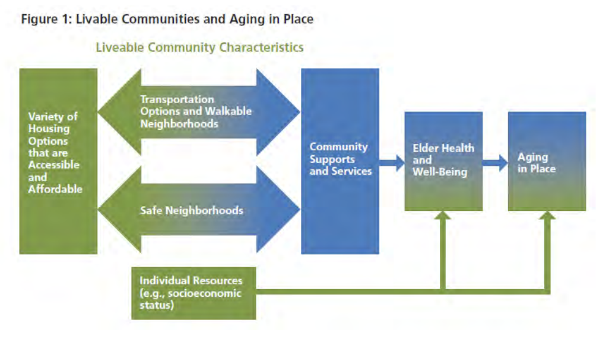

# Focus on Aging









This edition of the “Healthy Community Design Toolkit—Leveraging Positive Change” adds a focus on healthy aging. Older adults are increasing in number and as a percentage of our total population.`18` In 2030, it is predicted that the older population \(age 65 and over\) will be twice as large as it was in 2000 \(growing from 35 million to 72 million\).`19` In Massachusetts, it is predicted that people 65-and-over will increase from 14% of the population to 21% of the population in 2030.`20`

As people age, the built environment of their immediate home and neighborhood has an increasing effect on them.`21` This is the result of two factors. First, a person’s daily travel radius tends to shrink. Second, if an older person’s physical capacity is diminished, barriers within the built environment can become more inhibiting. What was once solely an inconvenience—like a busy intersection between home and a grocery store—can become a significant deterrent to healthy living, keeping them venturing out.

The concept of ‘environmental press’ developed by M. Powell Lawton in “Ecology and the Aging Process” \(1973\), is useful for understanding the relationship between healthy aging and community design. Lawton argues that there is an optimal level of fit between a person’s competence and their environment. If the environment does not challenge the person enough, it can lead to boredom and loss of capacity. If the environment is too stressful, the person may change their behavior in maladaptive ways. For example, if the busy intersection between home and the grocery store exceeds an older person’s driving competence level, the person may adapt by shifting from buying fresh, perishable fruits and vegetables to non-perishable foods so that he or she can reduce how often he or she needs to brave the intersection. Maladaptive behavior can in turn reduce competence, resulting in a downward spiral.`22`

The study of environmental press indicates that a supportive environment can help an older person maintain optimal functioning for as long as possible, while an environment that presents obstacles can hasten decline. The implication for our communities is that if communities can provide a supportive built environment for older adults, the community will benefit from a healthier, more self-reliant population. On the other hand, a failure to accommodate the needs of all people may result in reduced health for older adults \(as well as everybody else\) thereby initiating a reinforcing loop that further stresses our healthcare and social support systems.

One of the values of the concept of environmental press is that it recognizes that older adults are diverse—each older person has a unique set of competencies and they interact with the environment in unique ways. This leads us to the important conclusion that there is no “one size fits all” approach to community design that will ideally suit all older adults. Instead, our research shows that communities should pursue a diverse set of interventions—diversifying the built environment so that it can better meet the needs of a wide range of people.

Since World War II, the development of American neighborhoods and communities has been characterized by the opposite trend—homogenization. Housing has been segregated from commercial and industrial uses. Variety in housing types and lot sizes has been reduced and standardized, often resulting in economic and age-based segregation. Furthermore, a single mode of transportation—the personal car—has dominated transportation and land use planning. For older adults, this means their range of options is limited.`23` The neighborhoods where many older adults set down roots as young people with families do not necessarily meet their needs as older adults. The house and yard may require too much maintenance, or have excessive expenses. Main roads may be too heavily trafficked and/or too fast moving and feel unsafe. Walking options may be limited by a lack of proximity to desirable destinations and/or inadequate sidewalks. In unsupportive neighborhoods, older adults may experience a loss of independence and reduced social interaction which can have effects on both mental and physical health.

As Deborah Howe, professor and chair of the Department of Community and Regional _Planning_ at Temple University says, “If community livability is defined as a safe, engaging and healthy environment that allows us to carry out our daily activities, then senior citizens are shortchanged in most American communities.”`24` As the population ages, especially as the baby boom generation enters older adulthood, this is likely to become a major challenge. While our demographics are shifting rapidly, the built environment generally changes incrementally and slowly. Communities need to start making proactive changes now so that they can be prepared to meet the needs of an aging population. The consequences for communities that do not act will likely include reduced quality of life for older adults, deteriorating health outcomes, decreased independence, shorter life spans, increased health care costs, and crippling demand on service providers, community organization, and family care givers. In some areas, communities may see flight of older adults with more resources to communities that better suit their needs along with associated declines in property values and tax revenues.

One of the challenges when planning for the needs of older adults is to avoid stereotypes and stigmas—particularly regarding physical abilities and health. When advocating for healthy aging in community design, it is important to always keep in mind that that declines in health vary from person to person and the vast majority of older adults report that their overall health is good, very good or excellent.`25` At the same time, we must acknowledge that aging is often accompanied by declines in physical capabilities and that those declines can have far reaching impacts on the individual. For example, strength typically declines by about 10 percent a decade after age 25 and declines by 15-30 percent per decade after age 50. Vision, hearing, stamina, balance and response time also often decline.`26` If these declines become significant enough, then small impediments in the built environment can result in a loss of competence for healthy daily living. For example, a loss in strength can result in an inability to carry groceries, or to step up a large curb.

Our approach in this update to the toolkit is to point out leverage points for better community design to meet the needs of older adults. We focus on specific interventions that will eliminate barriers for older adults with common physical limitations because these interventions will help not only the most vulnerable older adults, but also because the interventions will improve quality of life for everyone else.

So how do we begin to plan communities for healthy aging? Met Life in its report _Livable Community Indicators for Sustainable Aging in Place_, lays out a framework for Livable Communities and Aging in Place. They identify four key aspects of the built environment that must be in place for Livable Communities for older adults. The first is a variety of **housing** options that are accessible and affordable. The second is there must be adequate community supports and services to meet the needs of older adults. For the purposes of this toolkit we call community supports and services, “**destinations**” to stress the fact that community design is primarily concerned with the built components of supports and services—where they are located and how they are designed—rather than their business models or social aspects. Housing and destinations must be linked by diverse **transportation** options and walkable neighborhoods. And finally, underlying all of this there must be both the reality and the perception of **safety** for older adults and the **individual resources** that make it possible for an older person to meet his or her needs in the community.`27`

This framework—which actually applies equally well to any population—helps us evaluate the needs of older adults and links them to leverage points for improving the built environment.

In the remainder of this toolkit, look for the sections that detail the specific housing, destinations, and transportation needs of older adults and how communities can be designed to better meet those needs \(consideration of safety and diverse individual resources is woven throughout these sections\). The sections on healthy aging are set within a framework of leverage points for community design that work for all people \(including older adults\). But before we can dive in, it is important to understand the context within which community design plays out: municipal processes in the Commonwealth of Massachusetts.



`18` Durrett, Charles. _The Senior Cohousing Handbook: A Community Approach to Independent Living, 2nd Edition_. \(2009\). New Society Publishers.

`19` _Older Americans, 2012: Key Indicators of Well-Being_ \(2012\). Federal Interagency Forum on Aging-Related Statistics \(Forum\)

`20` Renski, Henry, Koshgarian, Strate, Susan. _Section II. State Level Summary excerpt from: Long-term Population Projections for Massachusetts Regions and Municipailites_ \(November 2013\). UMass Donahue Institute.

`21` Hans-Werner Wahl, Susanne Iwarsson, and Frank Oswald. _Aging Well and the Environment: Toward and Integrative Model and Research Agenda for the future._ The Gerontologist Vol 52, No. 3, 306-316.

`22` M.P. Lawton and L. Nahemow. “Ecology and the Aging Process,” in _The Psychology of Adult Development and Aging,_ ed. C. Eisdorfer and M.P. Lawton \(1973\). Washington, D.C.: American Psychological Association.

`23` Sarah Heaton Kennedy and Andrew L. Dannenburg. _Livability, Healthy, and Community Design_ in Fritz Wagner and Roger Caves. Eds. _Community Livability: Issues and Approaches to Sustaining the Well-Being of People and Communities_ \(2012\). Routledge.

`24` Deborah Howe. _Aging as the Foundation for Livable Communities_ in Fritz Wagner and Roger Caves. Eds._Community Livability: Issues and Approaches to Sustaining the Well-Being of People and Communities_ \(2012\). Routledge.

`25` _Older Americans, 2012: Key Indicators of Well-Being_ \(2012\). Federal Interagency Forum on Aging-Related Statistics \(Forum\)

`26` Greenhouse, Esther. _The Home Environment and Aging_ in Henry Cisneros, Margaret Dyer-Chamberlain, Jane Hickie \(Eds\). _Independent for Life: Homes and Neighborhoods for an Aging America._ \(2012\). Austin: University of Texas Press.

`27` _Livable Community Indicators for Sustainable Aging in Place._ \(2013\). Met Life Mature Market Institute.



