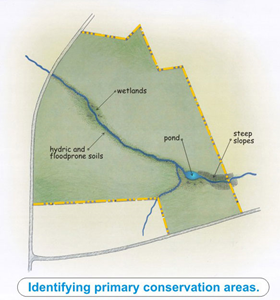

# Open Space Design \(OSD\) or Natural Resource Protection \(NRPZ\) Zoning

<table>
  <thead>
    <tr>
      <th style="text-align:center">Strength of Evidence</th>
      <th style="text-align:center">Community Types</th>
      <th style="text-align:center">Leverage Points</th>
      <th style="text-align:center">Co-benefits</th>
    </tr>
  </thead>
  <tbody>
    <tr>
      <td style="text-align:center">N/A</td>
      <td style="text-align:center">
        
Established Suburbs and Cape Cod Towns,

        
Maturing New England Towns,

        
Country Suburbs,

        
Rural Towns

      </td>
      <td style="text-align:center">
        

        
Zoning,

        
Master Plans, OSRP, Housing Plans

      </td>
      <td style="text-align:center">Economic, Environmental, Social</td>
    </tr>
  </tbody>
</table>

A primary benefit of Open Space Design \(OSD\) and Natural Resource Protection Zoning \(NRPZ\) is permanent preservation of open space at no cost to the municipality while providing housing and ensuring an adequate return for the landowner. OSD is thus most often useful where there are remaining large lots with development potential and significant natural resources such as farmland warrant conservation. For landowners and developers it has the benefit of predictable permitting, and reduced costs of construction and maintenance of roads, utilities, and stormwater runoff while maintaining sales prices. 

OSD / NRPZ is similar to traditional cluster zoning in that projects use reduced dimensional requirements to cluster development and preserve remaining land. However, OSD/NRPZ seeks to prevent the often unsatisfactory outcome of traditional cluster zoning, where underlying zoning remains a determinant factor, built portions consist of sprawling detached single-use houses, and preserved lands are chosen to suit development convenience rather than for conservation value, functional open space use, or cultural/historic value at the peripheries of subdivisions or meandering in filaments through the site.

Several key features of NRPZ:

* There is no “underlying zoning;” NRPZ is the zoning for the selected area. Subdivisions must comply with NRPZ requirements in order to be a by-right use.
* NRPZ may allow non-subdivision development \(i.e., ANR and condominiums\). It can also work for non-residential or mixed-use development.
* The number of allowed dwelling units or non-residential floor area is calculated up-front by formula, usually based on the net acreage \(that is left after sloped, wetlands, and other restricted land is subtracted\), multiplied by a density factor.
* Bonus units may be added for TDR purchases, affordable housing, and other public goods. To further food access, bonus units could be awarded for providing community gardens, food processing facilities, or similar. In addition, bonus units could be provided in return for providing publicly accessible facilities that facilitate physical activity including recreation facilities or access to trails.
* The minimum portion of land to be permanently preserved is set by the ordinance. This might be as high as 60% in farmed or forested areas, but in developed areas suitable for growth because of existing infrastructure and a lack of natural resources, preserved land might be limited to enough to provide neighborhood parks and trails.
* A conservation analysis is used to identify significant natural, cultural, and historic features of the land to be preserved, including viable farmland.
* Development is concentrated using Open Space Design: flexible and reduced dimensional requirements. Duplexes, townhouses, and multi-family buildings may be allowed, while roadway and other infrastructure requirements may be varied within the development.




**MA NRPZ model**  
[http://www.mass.gov/envir/smart\_growth\_toolkit/bylaws/model-osd-nrpz-zoning-final.pdf](http://www.mass.gov/envir/smart_growth_toolkit/bylaws/model-osd-nrpz-zoning-final.pdf)

**PVPC OSRD model**  
[http://www.pvpc.org/sites/default/files/files/Open%20Space%20Residential%20Development%20Model%20Bylaw.docx](http://www.pvpc.org/sites/default/files/files/Open%20Space%20Residential%20Development%20Model%20Bylaw.docx)  
  
**PVPC Conservation Development model**  
[http://www.pvpc.org/sites/default/files/files/Conservation%20Development%20Model%20Bylaw.docx](http://www.pvpc.org/sites/default/files/files/Conservation%20Development%20Model%20Bylaw.docx)



**Example projects**  
[http://www.mass.gov/envir/smart\_growth\_toolkit/pages/SG-CS-osrd.html](http://www.mass.gov/envir/smart_growth_toolkit/pages/SG-CS-osrd.html)




[http://www.mass.gov/envir/smart\_growth\_toolkit/bylaws/green\_side\_smart\_growth\_nprz.pdf](http://www.mass.gov/envir/smart_growth_toolkit/bylaws/green_side_smart_growth_nprz.pdf) [http://www.mass.gov/envir/smart\_growth\_toolkit/pages/mod-osrd.html](http://www.mass.gov/envir/smart_growth_toolkit/pages/mod-osrd.html)



