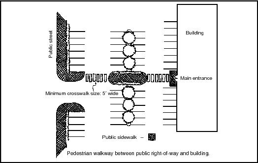

# Site Design

| **Strength of Evidence** | **Community Types** | **Leverage Points** | Co-benefits |
| :--- | :--- | :--- | :--- |
| Scientifically Supported \(streetscape design in general\) | All | Zoning, Site Plan/Special Permit | Economic, Environmental, Injury Prevention, Physical Health |

Poor site design can make it difficult or unsafe to access a food retail destination. This problem affects pedestrians and cyclists, in particular. Site circulation is especially a concern for sites with large parking lots—for example typical full-line grocery stores. It is not uncommon for these sites to lack coherent sidewalk networks, bicycle accommodations, or convenient bicycle parking.

Ensuring that site designs for food retail outlets provide safe and convenient access for pedestrians and bicyclists can support active transportation goals and also lower the burden of accessing food retail outlets for people without access to private cars. Unsafe site design is just one more barrier to accessing healthy food for people with limited transportation options especially those with mobility-impairments.

There are several basic elements of safe site designs for pedestrians and bicyclists:

* Separate pedestrians from motor vehicle traffic by providing grade separated sidewalks
* Ensure that locations where pedestrian paths cross motor vehicle lanes are highly visible and clearly indicate that pedestrians have the right of way
* Ensure that pedestrian paths take the shortest route possible from any adjacent public ways \(e.g. sidewalks, or multi-use paths\) to the door of the store.
* Limit front parking to ensure that stores are sited as close as possible to public ways. This shortens the distance a pedestrian or bicyclist must travel to reach the interior of the store
* Ensure that the front door of a store is visually prominent
* Provide adequate bicycle parking as close to possible to the front door of a store 

Municipalities can ensure safe site design by requiring it in their zoning regulations. The requirements can be incorporated into site plan review and/or special permit standards or through parking standards. Model language is included below.



1. **Pedestrian Access** \[this section should be located in a general requirements, access, or parking section.\]

1.1.    General – Promoting an interconnected network of pedestrian routes within neighborhoods is an important goal within \[community\]. Pedestrian access between buildings and rights-of-way, between uses on the subject property, and between properties helps ensure pedestrian safety, promotes healthy transportation, and reduces reliance on vehicles. This section establishes regulations for pedestrian access that primarily serves users of the subject property.

1.2. Pedestrian Access Location. All new development \[_and substantially expanded or remodeled sites/buildings/uses_\] shall comply with the following pedestrian access requirements:

1. Along the Right-of-Way. The \[Planning Board\] may require the applicant to install pedestrian walkways for use by the general public within the public right-of-way on which the subject property fronts. \[_This shall be required where a pedestrian connection is indicated in the Master Plan / Pedestrian Connectivity Plan_\].
2. From Buildings to Sidewalks and Transit Facilities. Pedestrian walkways designed to minimize walking distance from the primary entrances of all buildings to the abutting rights-of-way, public sidewalks, and transit facilities shall be provided.
3. Between Uses on Subject Property. Pedestrian walkways between the primary entrances to all businesses, uses, and/or buildings on the subject property shall be provided.
4. Between Properties. Provide pedestrian walkways connecting to adjacent properties of similar uses. The location for the access points at property edges and to adjacent lots shall be coordinated to provide convenient pedestrian links between developments. Walkways in the public right-of-way may satisfy this requirement if they provide a convenient link.
5. Through Parking Areas. All parking lots which contain more than _\[25\]_ stalls must include pedestrian walkways through the parking lot to the main building entrance or a central location.
6. Through Parking Garages. Provide marked pedestrian routes through parking garages from the [parking area](http://www.codepublishing.com/WA/Kirkland/cgi/defs.pl?def=632) to the abutting public [right-of-way](http://www.codepublishing.com/WA/Kirkland/cgi/defs.pl?def=805) and to the pedestrian entrance of the building.

1.3. Pedestrian Access Design Standards.

1. General.
   1. Walkways shall be a minimum of five \(5\) feet wide;
   2. Walkways shall be distinguishable from traffic lanes by painted markings, pavement material, texture, or raised in elevation;
   3. Walkways shall have adequate lighting for security and safety. Lights must be non-glare and mounted no more than 20 feet above the ground;
   4. Walkways shall be accessible.
2. Overhead Weather Protection. Protection in the form of awnings, marquees, canopies, building overhangs, covered porches, recessed entries or other features shall be provided over primary exterior entrances. Weather protection must cover at least three \(3\) feet of the width of the adjacent walkway and must be at least eight \(8\) feet above walkway immediately below it. _\[May need to match this section with any design guidelines or other façade controls.\]_
3. Parking lots containing more than 25,000 square feet of paved area, including access lanes and driveways, shall include clearly identified pedestrian routes from the parking stalls to the main building entrance or central location \(see Figure B\). At a minimum, walkways shall be provided for every three \(3\) driving aisles or 180 feet, whichever is less.

**2. Bicycle Access** _\[this section should be located in the parking section\]_

2.1 In any development required to provide twelve \(12\) or more vehicle parking spaces, bicycle parking shall also be provided. Bicycle parking spaces shall be provided at a ratio of on bicycle space for each 12 required vehicle parking spaces. U-shaped bicycle racks shall count as two bicycle spaces.

2.2 Bicycle parking shall be conveniently located, generally within 50 feet of exterior entrances. Bicycle racks shall be located in a visible and well lit area. Overhead weather sheltering of bicycle parking by eaves, awnings, or other similar is encouraged.



