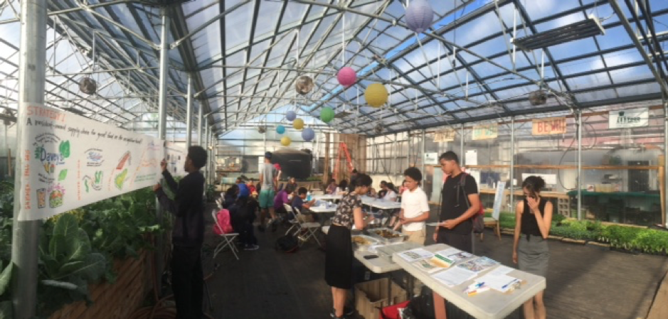

# Create Food Plans

<table>
  <thead>
    <tr>
      <th style="text-align:center">Strength of Evidence</th>
      <th style="text-align:center">Community Types</th>
      <th style="text-align:left">Leverage Points</th>
      <th style="text-align:left">Co-benefits</th>
    </tr>
  </thead>
  <tbody>
    <tr>
      <td style="text-align:center">N/A</td>
      <td style="text-align:center">All</td>
      <td style="text-align:left">
        
Community Plans,

        
Comprehensive food plans

      </td>
      <td style="text-align:left">Economic Environmental</td>
    </tr>
  </tbody>
</table>

A food plan synthesizes a community’s shared vision for their food system and serves as a guide for advocates and municipal officials to make strategic changes. Since the early 2000s, a heightened awareness of issues of food supply chains – food insecurity, accelerating loss of farmland, persistent threats to the livelihoods of farmers and fishermen -  have motivated increasingly more communities to make systemic changes through food planning. The recommended policies and programmatic changes in food plans provide a framework for action. Actions can include developing farmland preservation policies; supporting business development for markets selling healthy food; or developing avenues for healthy food distribution to schools, senior housing or other institutions. Recognizing that food system improvements support healthy community development broadly, food plans often also adopt overarching goals to enhance equity, public health, the economy, and ecological sustainability through food system changes. APA’s Policy Guide on Community and Regional Food Planning`[2]` recommends adopting the following overarching goals:

1. Help build stronger, sustainable, and more self-reliant community and regional food systems, and,
2. Suggest ways the industrial food system may interact with communities and regions to enhance benefits such as economic vitality, public health, ecological sustainability, social equity, and cultural diversity.

  Whereas some food plans are comprehensive in scope, others have a narrower focus. The particular interests, needs and purpose, considered alongside resources and time available for the planning process influence what a food plan includes. If comprehensive, a food plan typically examines the conditions and needs of agriculture and seafood industries; food 
processing and shared-use kitchen facilities; food distribution systems; the food retail environment and economy; and communities experiencing food insecurity and food access issues. Some plans focus primarily on addressing issues of food insecurity and food access; such a focus is typical for urban communities. Rural or suburban communities contending with development pressures may focus on agricultural production and farmland preservation. While the focus of food plans differ and are particular to certain communities, most include similar components, including an assessment of current conditions informed by a combination of local knowledge and existing data sources, and recommended goals and actions that align with the food system vision, and seek to resolve identified issues, and leverage existing assets. `3` `4`

Several Massachusetts communities have completed food plans that can serve as examples for communities interested in doing the same. Those highlighted below offer examples of food plans completed at various scales, including a three-county region, a city, a town, and an urban neighborhood. Food planning processes require considerable preparation and ongoing effort, from the early stages through coordinating and measuring change. Select guidance documents below provide frameworks and additional considerations for food planning. Worth emphasis, extensive community engagement in developing and executing food plans is essential. Improving the food system requires the action of a range of stakeholders, including residents, local organizations and businesses, and municipal officials. Because of this, it is imperative that these stakeholders endorse the recommended actions. Such investment should be cultivated by engaging stakeholders throughout the planning process in learning about the food system needs, and identifying the best methods for addressing those needs.

This guide is intended for planners, and describes food system planning as an emerging field that supports advancements across conventional planning areas, including land use, economic development, and transportation planning. The guide promotes comprehensive food planning and roles planners can play in advancing the following food policies:

1. Support comprehensive food planning process at the community and regional levels;
2. Support strengthening the local and regional economy by promoting local and regional food systems;
3. Support food systems that improve the health of the region's residents;
4. Support food systems that are ecologically sustainable;
5. Support food systems that are equitable and just;
6. Support food systems that preserve and sustain diverse traditional food cultures of Native American and other ethnic minority communities;
7. Support the development of state and federal legislation to facilitate community and regional food planning discussed in general policies \#1 through \#6**.**



### **Examples:**


**Regional – Bristol, Norfolk, Plymouth Counties**: [The Southeastern Massachusetts Food System Assessment](http://semafoodsecurity.com/food-system-assessment/)

The Southeastern Massachusetts Food System Assessment is a comprehensive food system assessment for Bristol, Norfolk, and Plymouth counties, and was completed in 2014 by the Southeastern Massachusetts Food Security Network. It offers a thorough assessment of the food system, using available data and limited community input, and identifies specific gaps, barriers and needs. In a region with nationally significant shellfish and cranberry industries, the assessment identifies the region’s existing food system infrastructure as unique assets that could aid in increasing local production for local consumption. The food assessment is intended to inform the development of an implementation plan that will lie out goals that
 address identified food system opportunities.



**City – Lowell:** Lowell Community Food Assessment: [Creating Capacity for a Healthy Food System](https://lowellfoodsecurity.files.wordpress.com/2013/02/lcfa_final-draft-minimized.pdf)

The Lowell Community Food Assessment is a comprehensive food system assessment for Lowell, a former mill city with an ethnically diverse population of over 106,000. The assessment was completed in 2013 by the Lowell Community Food Security Coalition, a coalition with an advisory board representing city officials, community organizations, and a university. It assesses three primary areas: food production, distribution, and consumption. The report recommends local and regional food production support; improved food access to healthy foods; cooking and nutrition education; and strengthened emergency food services.

Completed in the same year, Setting the Table: Towards Greater Food Security In Lowell, Massachusetts examines food security in the city through the following aspects that enable or impede food security: stability, affordability, proximity, choice, and preparation. Unique to most food plans, issues are explored and recommendations presented through a combination of data and storytelling. [https://issuu.com/conwaydesign/docs/settingthetable13.5.25final\_issuu\_f/2?e=1127520/4262584](https://issuu.com/conwaydesign/docs/settingthetable13.5.25final_issuu_f/2?e=1127520/4262584)



**Town** – Concord: Building Local Food Connections: [A Community Food System Assessment](https://issuu.com/conwaydesign/docs/concordfood2012)

Concord is a suburban town of about 18,000 residents, just northwest of Boston. The town has a history of agriculture, and while today it values agricultural preservation, it has been losing farmland consistently for the past 20 years. The town’s comprehensive food system assessment was conducted in 2012 by students from The Conway School, and evaluates this, and a range of other food system areas. Among its recommendations, the following are identified as critical:

1. Establish a local food policy council
2. Implement farm-to-institution programs
3. Promote a town-wide gardening movement
4. Revitalize animal husbandry in Concord
5. Match farmers and growers with suitable land in Concord
6. Permanently protect farmland for agricultural use.

The Concord Food Collaborative is the open network of stakeholders invested in food system changes.



**Neighborhood** – Dorchester: [Dudley Grows](http://thefoodproject.org/sites/default/files/Dudley_Grows_Case_Study_%28Tufts_UEP%29.pdf)

Residents of Boston’s Dudley neighborhood are asserting their right to build the community and food system they want, organizing their efforts through the Dudley Grows network. This community has a deep expertise of growing food, a vibrant network of locally owned stores and a long tradition of community activism. The community also shows classic indicators of a dysfunctional food system, with high rates of diabetes, obesity, and heart disease. Over half the neighborhood households have incomes of under $25,000 a year. It is in this context that residents, businesses, and community organizations worked together over a nine month period \(2014-2015\) to define a vision for their food system through a planning process co-facilitated by the Dudley Street Neighborhood Initiative \(DSNI\), The Food Project, and Alternatives for Community and Environment \(ACE\). Drawing on DSNI’s community organizing model, residents led the process to define values, goals, and strategies for achieving their vision for the neighborhood food system, which the Dudley Grows network is now acting on together.

**Vision:** _Dudley Grows envisions a local, resident-led food system that provides access to nutritious, affordable healthy food to all our neighbors, brings economic opportunities to residents, and protects the environment._

\_\_

| Goals and Achievements |  |
| :--- | :--- |
| Goal 1 | A resident-owned supply chain for great food, growing businesses that build neighborhood wealth. Achievement Highlights: resident-owned businesses Davey’s Market and Nos Casa Café piloted selling locally-grown produce and prepared fruit cups and salads in 2015, to test the market for a newly revived and expanded resident-owned wholesaling enterprise, Fidalgo’s Wholesale, that will supply neighborhood stores and restaurants; Fidalgo’s Wholesale has installed infrastructure and will begin distributing a range of healthy foods to neighborhood stores in summer 2016. |
| Goal 2 | Permanently secured vacant land for growing, so any resident who wishes to produce food can do so. Achievement Highlights: Two new community growing spaces were installed in spring 2016 on the community’s land trust, and the neighborhood is considering proposals for an additional urban farm site on the land trust. |
| Goal 3 | Improved food in local schools, ensuring that youth are nourished with healthy food they enjoy. Achievement Highlights: School food focus groups conducted by 8th graders, as part of a larger research and exploration effort by the Dudley Grows network; taste testing neighborhood-grown produce with elementary school students. |
| Goal 4 | Physical development that supports the food system vision with infrastructure and planning. Achievement Highlights: RFP for a new commercial development on the land trust calls for a café space that will allow expansion of resident-owned businesses; neighbors are organizing to ensure that a new mixed-use development aligns with neighborhood interests, including food system interests. |






**APA Policy Guide on Community and Regional Food Planning**: [https://www.planning.org/policy/guides/adopted/food.htm](https://www.planning.org/policy/guides/adopted/food.htm)

**Municipal Food System Planning Toolkit for MAPC Communities** [http://www.mapc.org/sites/default/files/Food\_system\_guide\_3-18-14.pdf](http://www.mapc.org/sites/default/files/Food_system_guide_3-18-14.pdf)  
Developed for MAPC communities, this toolkit is generally useful to municipal officials and community leaders across Massachusetts. It is intended to guide communities through the food planning process, and includes several additional tools and resources.    

**The Collective Impact Framework**: [http://www.collaborationforimpact.com/collective-impact/](http://www.collaborationforimpact.com/collective-impact/)  
 The Collective Impact framework offers an approach for addressing complex social problems and effect lasting change through a collaborative process. This approach has been applied to several food planning processes, promotes sound planning practices, and is intended for use by those coordinating planning processes.



`[4]` Food System Assessments. \(2013\) Cultivate your Food Economy, Tufts University. Retrieved from: http://sites.tufts.edu/foodeconomyfinalreport/practical-visionaries-history/theoretical-framework/food-systems-assessment/

`[3]` Are We Planning for Sustainable Food Systems? An Evaluation of the Goals and Vision of Food System Assessments and their Usefulness to Planning. \(2012\) Mari Pierce-Quinonez, Tufts University. Retrieved from: https://dl.dropboxusercontent.com/u/3053277/Food%20System%20Assessments%20and%20their%20Usefulness%20to%20Planning.pdf

`[2]` APA Policy Guide on Community and Regional Food Planning. \(2007\) American Planning Association. Retrieved from: [https://www.planning.org/policy/guides/adopted/food.htm](https://www.planning.org/policy/guides/adopted/food.htm)  



