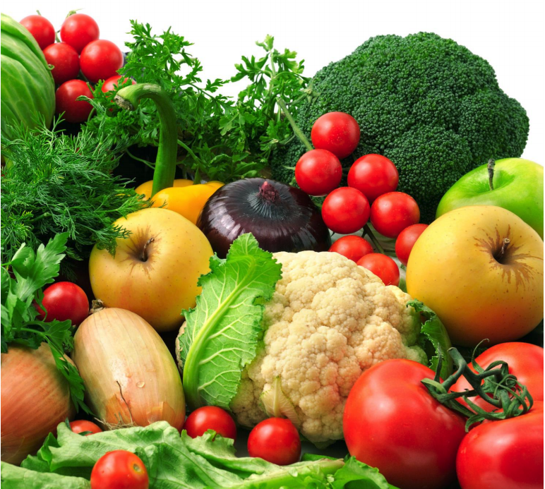

# Food Systems in Master Plans

<table>
  <thead>
    <tr>
      <th style="text-align:center">Strength of Evidence</th>
      <th style="text-align:center">Community Types</th>
      <th style="text-align:left">Leverage Points</th>
      <th style="text-align:left">Co-benefits</th>
    </tr>
  </thead>
  <tbody>
    <tr>
      <td style="text-align:center">N/A</td>
      <td style="text-align:center">All</td>
      <td style="text-align:left">Master Plan OSRP Other Plans</td>
      <td style="text-align:left">
        
Economic

        
Environmental

        
Physical Health

      </td>
    </tr>
  </tbody>
</table>

Municipal plans establish a vision for a community’s future. Integrating food goals and policies into municipal planning documents reinforces the connections of food system in conventionally addressed topics such as land use, transportation, housing, economic development, and environmental and human health elements. Where food policies are woven throughout such documents, these policies and a vision for improved food systems can be advanced as part of long term strategic community development plans. Master \(or comprehensive\) plans cover a wide range of topics that cut across many government functions and departments; including food system goals in a master plan, as well as supportive language in the plan’s overarching vision and objectives can help to ensure consideration of and action on food related goals and policies. Food goals and policies may also be integrated into other plans such as open space and recreation plans, transportation plans, or neighborhood development plans.`[5]` As communities develop plans on emergent topics, such as climate plans, they should integrate food security and related goals. Food goals can be included in several areas within municipal plans including the following:`[6]`

* **Vision Statement**: Language on improving access to healthy foods or other overarching food goals can be included here.
* **Land Use Component**: Land use strategies, particularly in urban areas should promote density and walkability, and thereby increase access to community services and features, such as food retail locations.
* **Circulation and Transportation Component**: This component should accommodate multimodal transportation that enables ease of movement and accessing community services and features, such as food pantries.
* **Housing Component**: This component should support affordable housing, and can promote affordable food access goals.
* **Parks and Recreation Component**: Community gardens and urban farm goals can be included in this component.
* **Public Facilities and Services Component**: This component can promote joint use agreements for kitchens in schools or other municipal buildings.

Including food goals and policies into municipal plans should also include a review of current municipal policies to identify where existing policies can more explicitly align with a food system vision, and remove unintended impediments.`[7]`




#### **Master Plan - Boxborough**: [Boxborough 2030](http://www.boxborough-ma.gov/boxborough2030), A Rural, Engaged Community for All

Boxborough’s master plan, adopted in January 2016 lays out a long term vision for the town that reads: “Boxborough shall maintain its traditional values of rural open space, a first-rate educational system, agricultural and conservation lands, and historical roots while fostering a balanced economic environment and enhancing a close knit sense of community for all generations.” The vision statement explicitly identifies agriculture as a community value, and the plan lays out aspirations, goals, strategies, and action steps for ensuring agricultural preservation. Specific town entities are identified as responsible for leading efforts on these actions. Following are the food related elements in the plan:

_Aspiration: Is thoughtfully developed: …The community’s agricultural assets will be leveraged for economic development and to enhance quality of life…_

**Goal: 3.2.** **Attract and retain business in key existing and emerging industries.**

* **Strategy 3.2.2.** Foster Boxborough’s participation in a sustainable regional agricultural economy.
  * Action 3.2.2.1. Develop a community food plan to create a vision, identify issues, barriers, challenges, and opportunities in the agricultural economy.
  * Action 3.2.2.2. Ensure that Town policies and regulations are supportive of agriculture.
  * Action 3.2.2.3. Recruit existing local farmers and work with non-profit organizations to cultivate workforce development, training, and educational programs.
  * Action 3.2.2.4. Expand land lease programs for local farms and farmers using town-owned lands to increase agricultural viability.
  * Action 3.2.2.5. Periodically review the Boxborough Right to Farm Bylaw and make amendments as necessary.
  * Action 3.2.2.6. Review Town policies and regulations and amend as necessary to ensure clarity and consistency of agricultural use definitions.
  * Action 3.2.2.7. Consider adding “Agricultural Business” in the Zoning Bylaw’s Use Regulations as a permitted use in residential and business districts to allow farm stands and similar agricultural business operations at existing and future farms.
* **Strategy 3.2.3.** Preserve farmland and areas with soils favorable for agriculture.
  * Action 3.2.3.1. Identify and index opportunity sites for farmland preservation in accordance with the 2015-2022 Open Space and Recreation Plan.
  * Action 3.2.3.2. Identify federal and state incentives or supplemental revenue streams to support viability for working farms. Action 3.2.3.3. Consider using CPA funds to acquire and preserve farmlands, giving priority to properties under Chapter 61A and 61B.
  * Action 3.2.2.1. Develop a community food plan to create a vision, identify issues, barriers, challenges, and opportunities in the agricultural economy.
  * Action 3.2.2.2. Ensure that Town policies and regulations are supportive of agriculture.
  * Action 3.2.2.3. Recruit existing local farmers and work with non-profit organizations to cultivate workforce development, training, and educational programs.
  * Action 3.2.2.4. Expand land lease programs for local farms and farmers using town-owned lands to increase agricultural viability.
  * Action 3.2.2.5. Periodically review the Boxborough Right to Farm Bylaw and make amendments as necessary.
  * Action 3.2.2.6. Review Town policies and regulations and amend as necessary to ensure clarity and consistency of agricultural use definitions.
  * Action 3.2.2.7. Consider adding “Agricultural Business” in the Zoning Bylaw’s Use Regulations as a permitted use in residential and business districts to allow farm stands and similar agricultural business operations at existing and future farms.
* **Strategy 3.2.3.** Preserve farmland and areas with soils favorable for agriculture.
  * Action 3.2.3.1. Identify and index opportunity sites for farmland preservation in accordance with the 2015-2022 Open Space and Recreation Plan.
  * Action 3.2.3.2. Identify federal and state incentives or supplemental revenue streams to support viability for working farms. Action 3.2.3.3. Consider using CPA funds to acquire and preserve farmlands, giving priority to properties under Chapter 61A and 61B.



#### **Master Plan – Hudson:** [Hudson Master Plan, 2014](https://www.vhb.com/Documents/Hudson%20Master%20Plan_final_November%202014.pdf)

In its recently completed master plan, Hudson includes a section on public health, with an assessment and recommendations for food access in the community.

**Plan excerpt: Public Health Needs: Healthy Food Access:**

Hudson is well-served by five supermarkets in Hudson, including BJ’s Wholesale Club, Hannaford Supermarket, Super Stop & Shop, Wal-Mart Supercenter, and Market Basket. These grocery stores provide affordable and healthy food options to the community. Supplementing these stores at the neighborhood level with additional smaller scale food entities that also sell local, affordable, and healthy food products would improve the Town’s food access. The community garden and food pantry provides an additional resource. Neighborhood level stores within walking distance of most Hudson residents would fill in any future food system holes. Access to local, healthy, and affordable food for everyone is key in developing a sustainable food system and addressing public health concerns related to food access. Currently, there are no farmers markets in Hudson. Establishing community supported agriculture \(CSA\) programs and weekly farmers markets during the growing season are another step Hudson can take towards improving the community’s food system.

**Plan excerpt: Goals and Strategies:**

Goal 3: Improve pedestrian amenities to encourage walking, running, bicycling, and public transit.

* SSPH-14. Incorporate healthy community design into Hudson’s planning process in order to make healthy choices easier for the Town’s residents. The concept of healthy community design links the traditional planning concepts including land use, transportation, community facilities, parks, and open space with health themes such as physical activity, public safety, healthy food access, mental health, air and water quality, and social equity issues.  ****Responsible parties: Town Planning Board, Board of Health

Goal 4: Develop additional programming and tasks related to public health and social services.

* SSPH-16. Educate Hudson residents of the importance of public health and its issues related to food access, transportation, and tobacco use through school programs, informational brochures, community workshops, mailing flyers, and through electronic media. Responsible Party: Board of Health




**Food Access Policy and Planning Guide**: [http://www.nyc.gov/html/ddc/downloads/pdf/ActiveDesignWebinar/King%20County%20Food%20Access%20Guide.pdf](http://www.nyc.gov/html/ddc/downloads/pdf/ActiveDesignWebinar/King%20County%20Food%20Access%20Guide.pdf)

**Planning to Eat? Innovative Local Government Plans and Policies to Build Healthy Food Systems in the United States**: [http://www.farmlandinfo.org/sites/default/files/Planning\_to\_eat\_SUNYBuffalo\_1.pdf](http://www.farmlandinfo.org/sites/default/files/Planning_to_eat_SUNYBuffalo_1.pdf)

**Municipal Food Systems Planning Toolkit for MAPC Communities**: [http://www.mapc.org/sites/default/files/Food\_system\_guide\_3-18-14.pdf](http://www.mapc.org/sites/default/files/Food_system_guide_3-18-14.pdf)



`[5]` Food Access Policy and Planning Guide. \(2011\) Eva Ringstrom and Branden Born, Northwest Center for Livable Communities. Retrieved from:[http://www.nyc.gov/html/ddc/downloads/pdf/ActiveDesignWebinar/King%20County%20Food%20Access%20Guide.pdf](http://www.nyc.gov/html/ddc/downloads/pdf/ActiveDesignWebinar/King%20County%20Food%20Access%20Guide.pdf)

`[6]` How to Create and Implement General Healthy Plans: A toolkit for building healthy, vibrant communities. \(2012\) Peter Stair, Healther Wooten, and Matt Raimi, ChangeLab Solutions. Retrieved from:[http://www.changelabsolutions.org/sites/default/files/Healthy\_General\_Plans\_Toolkit\_Updated\_20120517\_0.pdf](http://www.changelabsolutions.org/sites/default/files/Healthy_General_Plans_Toolkit_Updated_20120517_0.pdf)

`[7]` Integrating Food Policy in Comprehensive Planning: Strategies and Resources for the City of Seattle. \(2012\) Puget Sound Regional Council. Retrieved from:[http://www.seattle.gov/Documents/Departments/OSE/Seattle\_food\_comp\_plan\_FINAL\_082012.pdf](http://www.seattle.gov/Documents/Departments/OSE/Seattle_food_comp_plan_FINAL_082012.pdf)



\`\`

